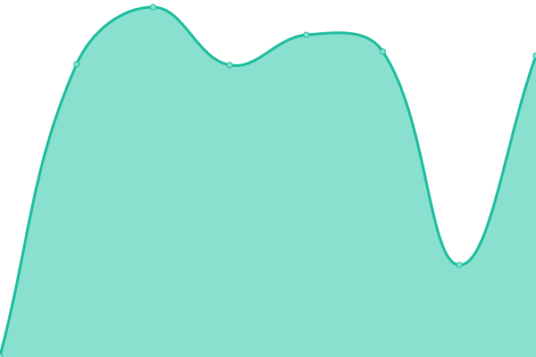

# [📈 Live Status](https://gsa.github.io/ai-experience-sharing-upptime): <!--live status--> **🟧 Partial outage**

This repository contains the open-source uptime monitor and status page for [U.S. General Services Administration](https://open.gsa.gov) AI Portfolio, powered by [Upptime](https://github.com/upptime/upptime).

With [Upptime](https://upptime.js.org), you can get your own unlimited and free uptime monitor and status page, powered entirely by a GitHub repository. We use [Issues](https://github.com/gsa/ai-experience-sharing-upptime/issues) as incident reports, [Actions](https://github.com/gsa/ai-experience-sharing-upptime/actions) as uptime monitors, and [Pages](https://gsa.github.io/ai-experience-sharing-upptime) for the status page.

<!--start: status pages-->
<!-- This summary is generated by Upptime (https://github.com/upptime/upptime) -->
<!-- Do not edit this manually, your changes will be overwritten -->
<!-- prettier-ignore -->
| URL | Status | History | Response Time | Uptime |
| --- | ------ | ------- | ------------- | ------ |
|  [AI Portfolio](https://strapi-api-host-prod.app.cloud.gov) | 🟩 Up | [ai-portfolio.yml](https://github.com/GSA/ai-experience-sharing-upptime/commits/HEAD/history/ai-portfolio.yml) | 

 289ms
     
 | 

<a href="https://gsa.github.io/ai-experience-sharing-upptime/history/ai-portfolio">100.00%</a>
    

|  [AI Portfolio Alert Test](https://strapi-api-host-staging-bad-url.app.cloud.gov) | 🟥 Down | [ai-portfolio-alert-test.yml](https://github.com/GSA/ai-experience-sharing-upptime/commits/HEAD/history/ai-portfolio-alert-test.yml) | 

 308ms
     
 | 

<a href="https://gsa.github.io/ai-experience-sharing-upptime/history/ai-portfolio-alert-test">51.47%</a>
    

<!--end: status pages-->

[**Visit our status website →**](https://gsa.github.io/ai-experience-sharing-upptime)

## 📄 License

- Powered by: [Upptime](https://github.com/upptime/upptime)
- Code: [MIT](./LICENSE) © [U.S. General Services Administration](https://open.gsa.gov)
- Data in the `./history` directory: [Open Database License](https://opendatacommons.org/licenses/odbl/1-0/)
